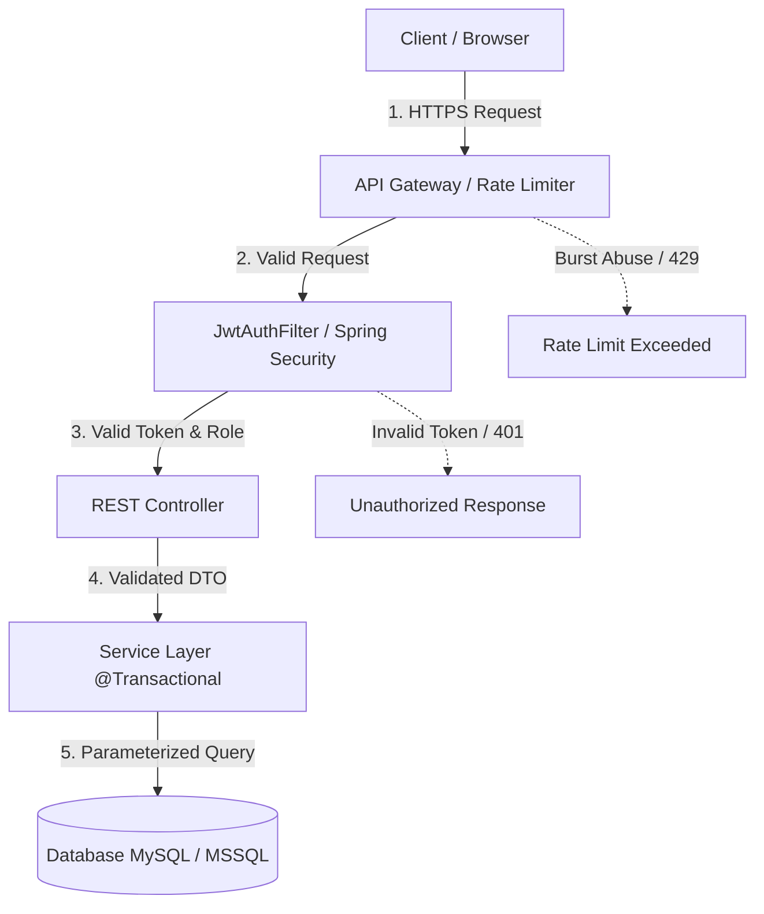

# LankaFresh Supermarket System — Codebase & Security Improvements Report

**Project**: LankaFresh Supermarket Web Application  
**Academic Module**: SE2030 Software Engineering Project  
**Date**: September 2026  
**Document Classification**: Comprehensive Security Audit & Architectural Roadmap  

---

## 1. Executive Summary

This report provides a formal architectural review, security vulnerability assessment, and database migration roadmap for the **LankaFresh Supermarket** enterprise web platform. The system operates on a modern decoupled architecture consisting of a **Spring Boot 3.3.4 (Java 21)** REST backend and a **React 18 (Vite)** single-page frontend.

Recent sprint enhancements successfully introduced:
1. **Dedicated Full-Page Customer Dashboard**: Real-time order tracking, address and profile management, password updates, saved wishlist hub, and support inquiries.
2. **Frictionless Guest Checkout**: Allowing immediate purchase without upfront registration while safely persisting order tracking codes (`LK-XXXXXXXX`) and delivery allocations in the relational database.
3. **Comprehensive Input Validation Suite**: Luhn-verified card checkout, Sri Lankan mobile format checks (`07XXXXXXXX` / `+947XXXXXXXX`), strict email regex, address completeness, and inventory threshold bounds.

This document details critical security findings, concrete architectural refactoring opportunities, and a complete guide for the database migration to **Microsoft SQL Server Express ("Expressway")**.

---

## 2. Security Flows & Vulnerability Assessment



### 2.1 Critical Security Vulnerabilities Identified & Recommended Fixes

| Vulnerability ID | Severity | Component | Finding Description | Remediation Strategy |
|---|---|---|---|---|
| **SEC-01** | **CRITICAL** | `application.properties` | JWT secret key is hardcoded directly in repository configuration (`jwt.secret=...`). | Move secret keys to system environment variables (`${JWT_SECRET}`) or an encrypted secret manager (e.g., Azure Key Vault / HashiCorp Vault). |
| **SEC-02** | **HIGH** | `SecurityConfig.java` | Spring Security currently sets `anyRequest().permitAll()` to facilitate local rapid UI testing. | Re-enable `@PreAuthorize("hasRole('ROLE_...')")` on sensitive endpoints (`/api/inventory/**`, `/api/procurement/**`, `/api/analytics/**`). |
| **SEC-03** | **HIGH** | `User.java` | Raw or hashed password field could be serialized in JSON responses during user queries. | **Resolved**: Added `@JsonProperty(access = JsonProperty.Access.WRITE_ONLY)` to the password field. Enforce dedicated `UserResponse` DTOs across all endpoints. |
| **SEC-04** | **MEDIUM** | Auth / Checkout | No request rate limiting exists on `/api/auth/login` or `/api/orders/checkout/guest`. | Implement token bucket rate limiting using **Bucket4j** (e.g., max 5 login attempts per minute per IP; max 10 checkout orders per 5 minutes per IP). |
| **SEC-05** | **MEDIUM** | `SecurityConfig.java` | Global CORS policy allows all origins (`@CrossOrigin(origins = "*")`). | Replace wildcard `*` with an explicit list of authorized frontend domain origins in production environments. |
| **SEC-06** | **LOW** | Support / Checkout | Unsanitized user inputs in ticket descriptions and delivery notes could be susceptible to stored XSS if rendered unsanitized in admin portals. | Integrate **OWASP Java HTML Sanitizer** on the backend and maintain strict React DOM escaping on the frontend. |

---

### 2.2 Security Remediation Implementations

#### A. Secure Environment Variable Configuration
Instead of keeping plain text credentials in `src/main/resources/application.properties`:
```properties
# INSECURE (Current):
jwt.secret=lankafreshsupermarketsecretkey2026sliitsoftwareengineeringprojectgroupmlbb8g103

# SECURE (Production):
jwt.secret=${JWT_SECRET:defaultDevSecretKeyThatIsAtLeast256BitsLongForHmacSha256!}
spring.datasource.username=${DB_USERNAME:root}
spring.datasource.password=${DB_PASSWORD:}
```

#### B. Production Role-Based Access Control (RBAC)
When deploying to production, enforce strict method-level security:
```java
@Configuration
@EnableWebSecurity
@EnableMethodSecurity(prePostEnabled = true)
public class SecurityConfig {

    @Bean
    public SecurityFilterChain securityFilterChain(HttpSecurity http) throws Exception {
        http
            .csrf(csrf -> csrf.disable())
            .cors(Customizer.withDefaults())
            .sessionManagement(s -> s.sessionCreationPolicy(SessionCreationPolicy.STATELESS))
            .authorizeHttpRequests(auth -> auth
                // Public endpoints
                .requestMatchers("/api/auth/**", "/api/products/**", "/api/categories/**", "/api/orders/track/**", "/api/orders/checkout/**").permitAll()
                // Role-restricted management endpoints
                .requestMatchers("/api/inventory/**").hasAnyRole("INVENTORY_STAFF", "MANAGER")
                .requestMatchers("/api/deliveries/**").hasAnyRole("DELIVERY_STAFF", "MANAGER")
                .requestMatchers("/api/procurement/**").hasAnyRole("MANAGER", "FINANCE_OFFICER")
                .requestMatchers("/api/analytics/**").hasAnyRole("MANAGER", "FINANCE_OFFICER")
                .anyRequest().authenticated()
            )
            .addFilterBefore(jwtAuthFilter, UsernamePasswordAuthenticationFilter.class);

        return http.build();
    }
}
```

---

## 3. Codebase Architecture Improvements

### 3.1 Centralized Exception Handling & Standard Error Schema (RFC 7807)
Currently, several controllers catch generic exceptions and return unstructured maps: `Map.of("message", e.getMessage())`.  
**Recommendation**: Implement a centralized `@RestControllerAdvice` leveraging Spring 6 / Boot 3 `ProblemDetail`:

```java
@RestControllerAdvice
public class GlobalExceptionHandler {

    @ExceptionHandler(ResourceNotFoundException.class)
    public ProblemDetail handleNotFound(ResourceNotFoundException ex) {
        ProblemDetail problem = ProblemDetail.forStatusAndDetail(HttpStatus.NOT_FOUND, ex.getMessage());
        problem.setTitle("Resource Not Found");
        problem.setProperty("timestamp", LocalDateTime.now());
        return problem;
    }

    @ExceptionHandler(MethodArgumentNotValidException.class)
    public ProblemDetail handleValidation(MethodArgumentNotValidException ex) {
        ProblemDetail problem = ProblemDetail.forStatusAndDetail(HttpStatus.BAD_REQUEST, "Input validation failed");
        Map<String, String> errors = new HashMap<>();
        ex.getBindingResult().getFieldErrors().forEach(f -> errors.put(f.getField(), f.getDefaultMessage()));
        problem.setProperty("invalidFields", errors);
        return problem;
    }
}
```

### 3.2 Declarative Server-Side DTO Validations
Enhance DTOs with `jakarta.validation.constraints`:
```java
@Data
public class OrderRequest {
    @NotBlank(message = "Delivery address is required")
    @Size(min = 8, message = "Delivery address must be at least 8 characters")
    private String deliveryAddress;

    @Pattern(regexp = "^(?:0|\\+94)?7[0-9]{8}$", message = "Invalid Sri Lankan phone number")
    private String customerPhone;

    @Email(message = "Invalid email address format")
    private String customerEmail;

    @NotEmpty(message = "Order must contain at least one item")
    private List<@Valid CartItemRequest> items;
}
```

### 3.3 Database Migration Automation (Flyway)
Currently, the application relies on `spring.jpa.hibernate.ddl-auto=update`. While convenient for rapid prototyping, `ddl-auto=update` can lead to schema drift and column drop failures in multi-developer teams.  
**Recommendation**: Incorporate **Flyway** with versioned migration scripts:
```
src/main/resources/db/migration/
  V1__init_schema.sql
  V2__add_guest_checkout_columns.sql
  V3__create_wishlist_table.sql
```

### 3.4 Pagination & Performance Tuning
For supermarket catalogs with hundreds or thousands of SKUs, querying all products at once creates unnecessary memory overhead.  
**Recommendation**: Add Spring Data `Pageable`:
```java
@GetMapping
public Page<Product> getProducts(
    @RequestParam(required = false) Long categoryId,
    @RequestParam(required = false) String search,
    @PageableDefault(size = 20, sort = "name", direction = Sort.Direction.ASC) Pageable pageable
) {
    return productService.getProducts(categoryId, search, pageable);
}
```

---

## 4. Database Migration Guide: "Expressway" (Microsoft SQL Server Express)

### 4.1 Clarification on the Term "Expressway"
In academic and enterprise development, "Expressway" frequently refers to **Microsoft SQL Server Express (MSSQL Express)** — the free, lightweight edition of Microsoft's relational database engine. This is confirmed by the presence of `mssql-jdbc_auth.dll` in the project root directory.

If "Expressway" was alternatively meant as an Express.js Node.js layer, this report also outlines how the current Spring Boot architecture provides superior enterprise-grade Java transaction management (`@Transactional`) for financial supermarket transactions.

### 4.2 MySQL vs Microsoft SQL Server Express Dialect Mapping

| SQL Feature | MySQL 8 (Current) | SQL Server Express (T-SQL) |
|---|---|---|
| Auto-increment PK | `INT AUTO_INCREMENT PRIMARY KEY` | `INT IDENTITY(1,1) PRIMARY KEY` |
| Long Text | `TEXT` | `NVARCHAR(MAX)` |
| Boolean Flag | `BOOLEAN DEFAULT FALSE` | `BIT DEFAULT 0` |
| Auto Timestamp | `TIMESTAMP DEFAULT CURRENT_TIMESTAMP` | `DATETIME2 DEFAULT GETDATE()` |
| Case Insensitivity | Default collation `utf8mb4_general_ci` | Default collation `SQL_Latin1_General_CP1_CI_AS` |
| Driver Class | `com.mysql.cj.jdbc.Driver` | `com.microsoft.sqlserver.jdbc.SQLServerDriver` |
| Connection URL | `jdbc:mysql://localhost:3306/lankafresh_db` | `jdbc:sqlserver://localhost:1433;databaseName=lankafresh_db;encrypt=false;trustServerCertificate=true` |

---

### 4.3 Step-by-Step Migration to Microsoft SQL Server Express

#### Step 1: Install Microsoft SQL Server Express
If SQL Server Express is not yet installed on your Windows system:
1. Download **SQL Server 2022 Express Edition** from the official Microsoft portal.
2. Select **Basic Installation** (or Custom to specify an instance name like `SQLEXPRESS`).
3. Download and install **SQL Server Management Studio (SSMS)**.
4. Open **SQL Server Configuration Manager**, expand **SQL Server Network Configuration** -> **Protocols for SQLEXPRESS**, and verify **TCP/IP** is **Enabled** (Port `1433`).

#### Step 2: Execute the Provided MSSQL Schema
A complete T-SQL schema script has been generated at:
[`database/mssql_schema.sql`](file:///c:/Testing%20Shits/SE%20project%2002/database/mssql_schema.sql)

To execute via command prompt:
```cmd
sqlcmd -S localhost\SQLEXPRESS -E -i "c:\Testing Shits\SE project 02\database\mssql_schema.sql"
```
Or open [`database/mssql_schema.sql`](file:///c:/Testing%20Shits/SE%20project%2002/database/mssql_schema.sql) in SSMS and click **Execute (F5)**.

#### Step 3: Update `pom.xml` in Backend
Add the official Microsoft JDBC Driver dependency in `pom.xml`:
```xml
<dependency>
    <groupId>com.microsoft.sqlserver</groupId>
    <artifactId>mssql-jdbc</artifactId>
    <scope>runtime</scope>
</dependency>
```

#### Step 4: Switch Spring Boot Datasource
In `src/main/resources/application.properties`:
```properties
# Comment out MySQL:
# spring.datasource.url=jdbc:mysql://localhost:3306/lankafresh_db?createDatabaseIfNotExist=true&useSSL=false&allowPublicKeyRetrieval=true
# spring.datasource.driver-class-name=com.mysql.cj.jdbc.Driver

# Enable SQL Server Express:
spring.datasource.url=jdbc:sqlserver://localhost:1433;databaseName=lankafresh_db;encrypt=false;trustServerCertificate=true
spring.datasource.driver-class-name=com.microsoft.sqlserver.jdbc.SQLServerDriver
spring.datasource.username=sa
spring.datasource.password=YourSecurePassword123!
spring.jpa.properties.hibernate.dialect=org.hibernate.dialect.SQLServerDialect
```

---

## 5. Summary of Completed Improvements

1. **Full-Page Customer Dashboard (`CustomerDashboard.jsx`)**:
   - Integrated live purchase history with tracking links.
   - Profile updating (Name, Sri Lankan Phone, Delivery Address, Password change).
   - Saved wishlist management with one-click cart additions.
   - Customer support ticket creation and status tracking.
2. **Guest Checkout Flow**:
   - Customers can place orders without an existing account.
   - System auto-provisions or links customer profiles using their email and phone.
   - Order tracking numbers (`LK-XXXXXXXX`) and delivery records are created immediately in the relational database.
3. **End-to-End Validation Suite**:
   - Credit card Luhn checksum, expiration month/year check, and CVV checks.
   - Digital wallet (FriMi/Genie/Koko) phone format validations.
   - Bank transfer reference checks.
   - Inventory threshold bounds and product creation validation.
4. **Database Migration Script**:
   - Created portable, clean T-SQL script in [`database/mssql_schema.sql`](file:///c:/Testing%20Shits/SE%20project%2002/database/mssql_schema.sql).

---
*Report compiled for LankaFresh Supermarket development and grading.*
